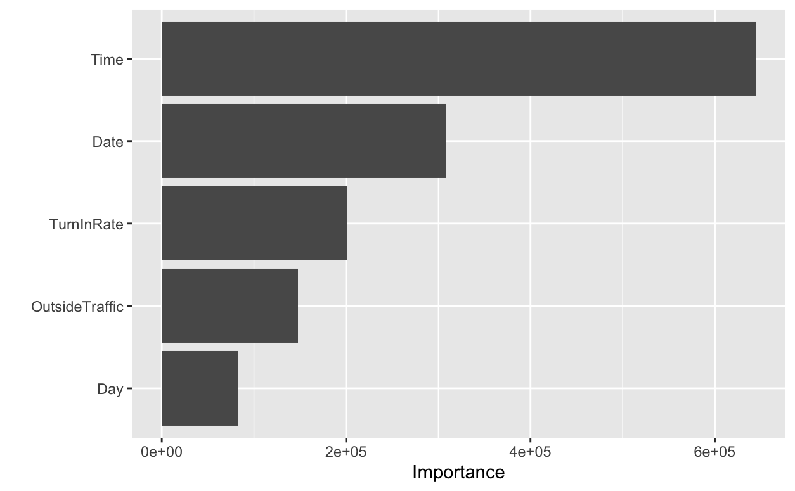
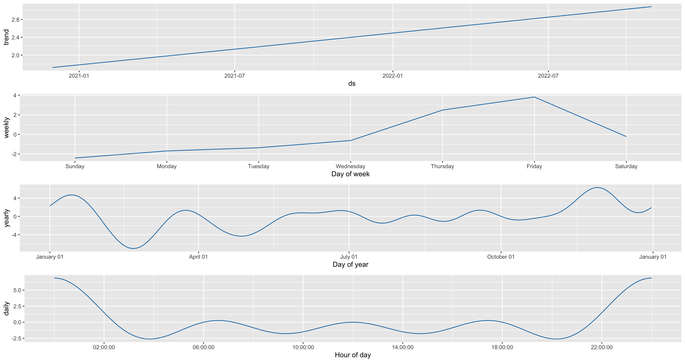
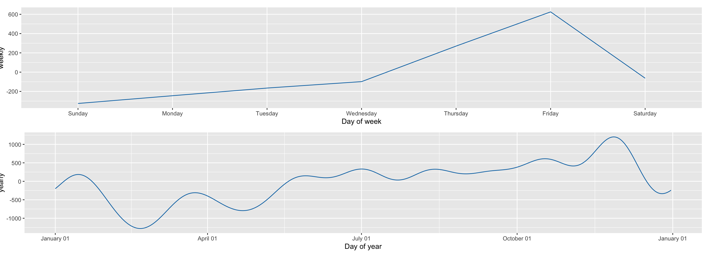

```{r setup, include=FALSE}
knitr::opts_chunk$set(echo = FALSE)
```


```{r,include = FALSE}
## load packages
library(tidyverse)
library(kknn)
library(ggrepel)
library(corrplot)
library(dplyr)       # for data manipulation
library(EnvStats)
library(RColorBrewer)
library(vip)         # for variable importance
#Time Series
library(tseries)
library(forecast)
library(xts)
library(fpp3)
library(tsibble)
library(prophet)
# Ploting
library(reshape2)
library(plotly)
library(ggplot2)
library(ggpubr)  #To arrange plots on one page

# Modeling process
library(tidymodels)

```

```{r}
#Downloading the data
sales.data <- read.csv("~/Documents/GitHub/DS_Capstone_Cafe_Analysis/sales-data.csv")
visit.dat <- read.csv("~/Documents/GitHub/DS_Capstone_Cafe_Analysis/Hourlydata.csv")
Items <- read.csv("~/Documents/GitHub/DS_Capstone_Cafe_Analysis/Items.csv")

```

# Important features that affect the number of visitors

Time and Date are the most important variables.
```{r, echo=FALSE}

```

# Effect of hours on visitors count
```{r echo=FALSE, cache=FALSE, results=TRUE, warning=FALSE, comment=FALSE, warning=FALSE}

Time_vig <- plot_ly(visit.dat, y =  visit.dat$ValueIn, type = 'bar', color = ~Time) %>%
  layout( barmode = 'stack')
Time_vig
```

- We can see that there are many customers at night from 7pm until 12pm, but the highest number of visitors were at 22pm and 23pm.

## The effect of the day on visitors count 
```{r, echo=FALSE, cache=FALSE}

ggplot(visit.dat, aes(fill = factor(Day), max(ValueIn))) +
  geom_bar(position = "dodge") +
  NULL
```

- weekends have the highest number of visitors.

# Discovering what are the best seller item using the products data 

```{r, echo=FALSE, cache=FALSE}
Items$item[Items$profits== max(Items$profits) & Items$count== max(Items$count)]
Items$profits[Items$item== "Flat white"]
```
Flat White is the best seller and most profitable item, the profits are 64124.9!


## Items with more than 2000 Pieces sold in 11 months 
```{r, echo=FALSE, cache=FALSE}
Items$item[Items$count > 2000]
```
The best selling items are drinks. Looks like we drink hot drinks even in the very hot weather,since most of them are hot drinks. (At least water is on the list)

## Which Items are not profitable? 
```{r, echo=FALSE, cache=FALSE}
#Choosing the items where the profits and counts are less than the average. 
Items$item[Items$profits == min(Items$profits)]
```

 Maybe it is a good idea to think about replacing or removing this drink.

# Trends

```{r, echo=FALSE, out.width="95%"}

```

Weekends have higher number of visitors, and after 11 pm there are more visitors.


## Daily Trend 

```{r, echo=FALSE, out.width="90%"}

```

It is the same for the profit, weekends have higher number of visitors, and after 11 pm there are more visitors.

## Seasonality 

- It is a repeating pattern within a year. We can not see that in our data because we don't have a record for a whole year.

There is no Seasonality in my data.


# Conclusion 

To increase the number of visitors and thus profits, I suggest focusing on weekends and night hours as they tend to increase the number of people. Also, removing unprofitable products  and increasing the number of profitable products may help.


